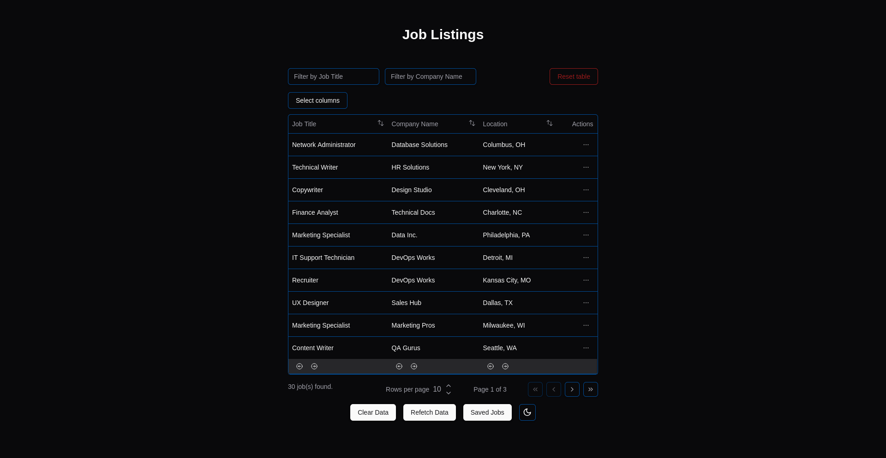
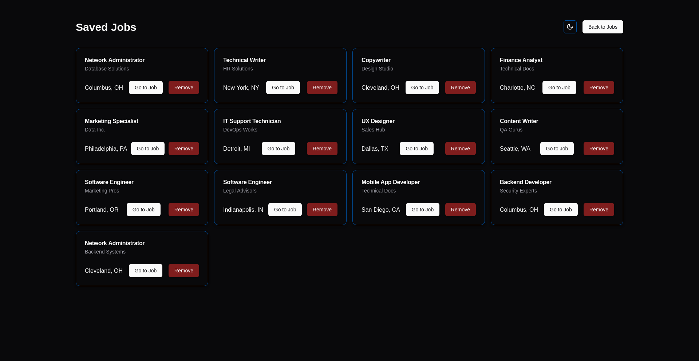
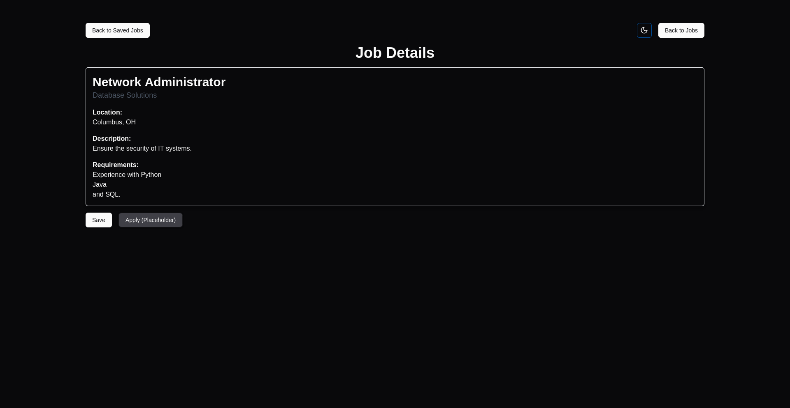

# UniBui Project

Welcome to the UniBui project! This application reads data from a CSV file containing job listings, allowing users to save jobs, view saved jobs, and access detailed information about individual job listings. It is built using Next.js and TypeScript.

## Table of Contents

- [Features](#features)
- [Getting Started](#getting-started)
- [Learn More](#learn-more)
- [Deploy on Vercel](#deploy-on-vercel)

## Features

- Filtering
- Sorting
- Reordering columns
- Column visibility
- Actions to save or remove job to local storage
- Pagination
- Dynamic row length
- Context to prevent multiple API calls
- Motion effects on saved jobs and job details page
- Dark mode
- Error handling for invalid routes
- Responsive web design

## Screenshots

Here are some screenshots of the UniBui project in action:





## Live Demo

Check out the live demo of the UniBui project [here](https://unibui.vercel.app).

This is a [Next.js](https://nextjs.org) project bootstrapped with [`create-next-app`](https://nextjs.org/docs/app/api-reference/cli/create-next-app).

## Getting Started

First, run the development server:

```bash
pnpm dev
```

Open [http://localhost:3000](http://localhost:3000) with your browser to see the result.

You can start editing the page by modifying `app/page.tsx`. The page auto-updates as you edit the file.

This project uses [`next/font`](https://nextjs.org/docs/app/building-your-application/optimizing/fonts) to automatically optimize and load [Geist](https://vercel.com/font), a new font family for Vercel.

## Learn More

To learn more about Next.js, take a look at the following resources:

- [Next.js Documentation](https://nextjs.org/docs) - learn about Next.js features and API.
- [Learn Next.js](https://nextjs.org/learn) - an interactive Next.js tutorial.

You can check out [the Next.js GitHub repository](https://github.com/vercel/next.js) - your feedback and contributions are welcome!

## Deploy on Vercel

The easiest way to deploy your Next.js app is to use the [Vercel Platform](https://vercel.com/new?utm_medium=default-template&filter=next.js&utm_source=create-next-app&utm_campaign=create-next-app-readme) from the creators of Next.js.

Check out our [Next.js deployment documentation](https://nextjs.org/docs/app/building-your-application/deploying) for more details.
